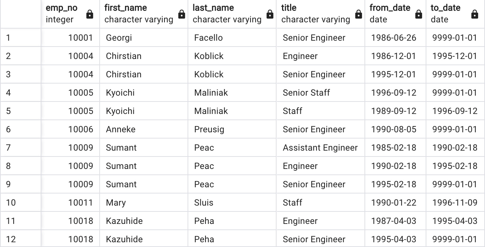
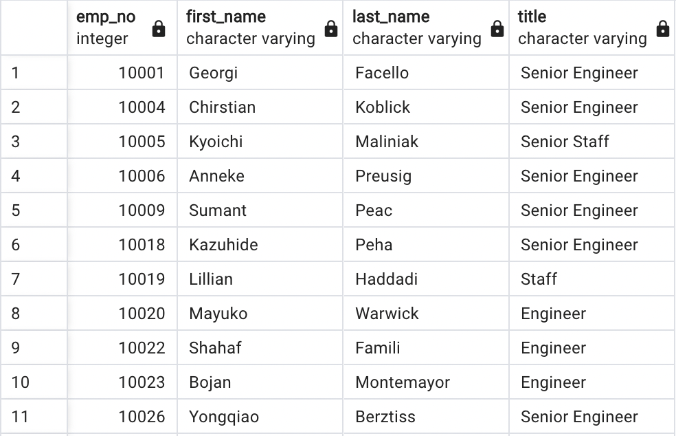
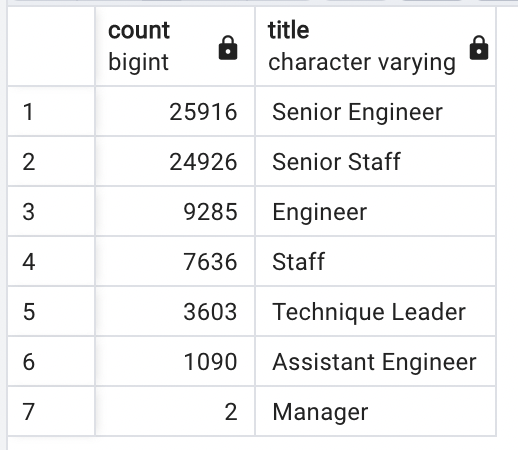
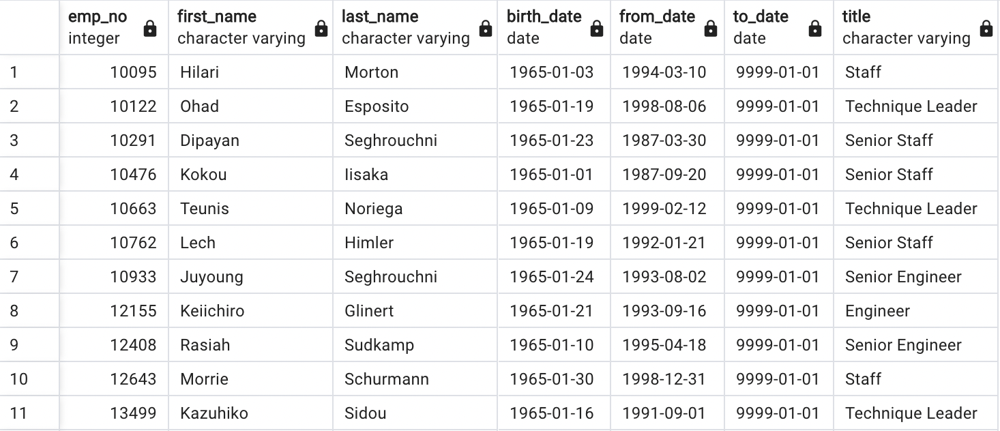
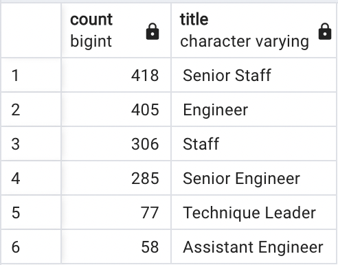
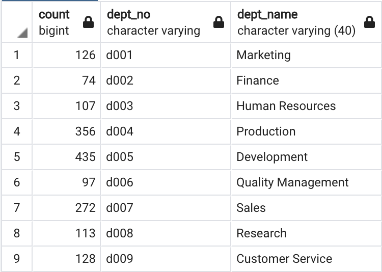
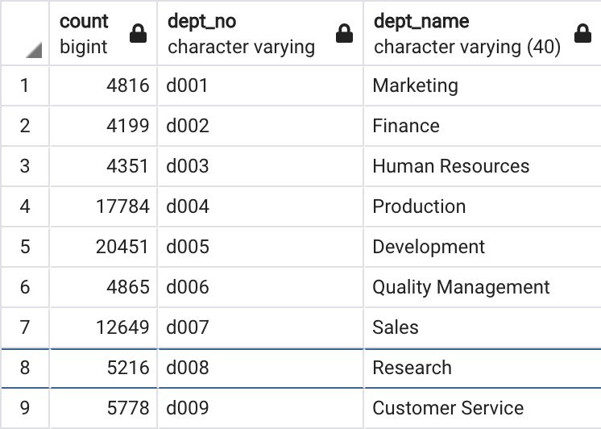

# Pewlett_Hackard_Analysis

# Overvie of the project
Due to a large number of employees reaching retirement age, Pewlett Hackard is planning to launch a mentoring program: Silver Tsunami. With this program, the employees who are reaching retirement age can mentor the eligible employees to receive the training and get prepared to step up to roles when the employees who reach retiring age step down or retired. And help filter out the employees who are eligible for the program.
# Results
- First, we create a list of employees who are reaching retirement age, but due to the title changes over the years (such as promotions), we have duplicate data in this list.

[Click here for the full retirement_titles list](Data/Retirement_titles.csv)

- We refined the list of retiring employees, including names, titles, and employee numbers, and removed duplicate rows.

[Click here for the full retiring list](Data/unique_title.csv)

- From the result we can see that there are 72,458 employees will be reaching retirement age soon, the break down of the number is the image below:

- We created a list of employees who are eligible (which is the ones has the birth_date in the year 1965) for the mentoring program

[Click here full list of the mentorship eligibility](Data/mentorship_eligibility.csv)

# Summary
**1. How many roles will need to be filled as the "silver tsunami" begins to make an impact?**

From the list we can see there are 1,549 employees are eligible for the mentorship program, and the breakdown of the number as the image below:

If all the eligible employees transition to the mentor roles, it will create 1,549 position openings, which will need to be filled.

**2. Are there enough qualified, retirement-ready employees in the departments to mentor the next generation of Pewlett Hackard employees?**

Here is the result of mentorship eligible employees counts by department:

Depending on the detail of the program, if the mentor would be doing 1-on-1 with the new hires, the number of mentors for each department could potentially not be enough, take department d001 (Marketing) for example, the retirees in the marketing department is 4,816 (the break down of retirees by departments is attached below), which will create the 4,816 of positions need to be filled. But considering the estimated numbers of retirees are those who are born between 1952-1955, which means it's possible not all the retirees will retire all at once, but in the course of 3 years, that means the 126 mentors won't be taking 4,816 new employees all at once, which seems much less overwhelming.

If the program for the mentor roles are more step in when the new hire need guidance rather than 1-on-1, the number seems sufficient, taking the consideration the roles that need to be filled will possibly happen over 3 years, continue with the example of the marketing department, the 126 mentors will take a lot less then total 4,816 of newly hired employees, which in my opinion will be a better option and likely less overwhelming for the mentors.

